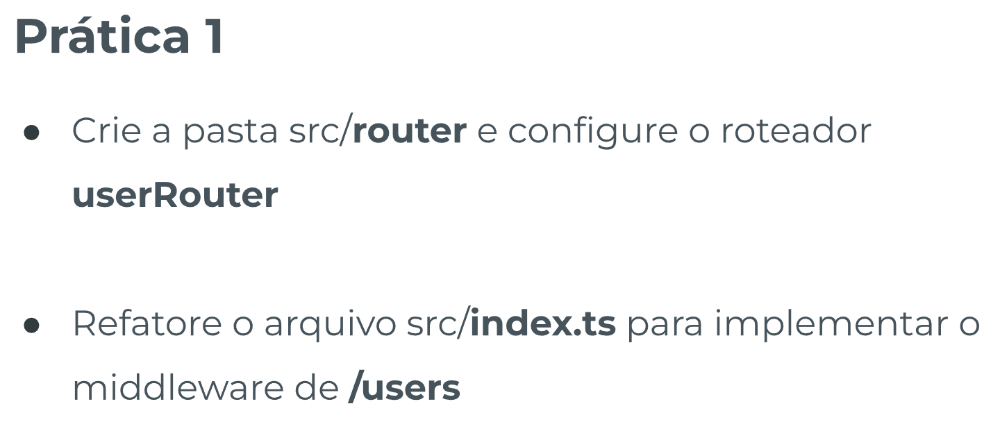
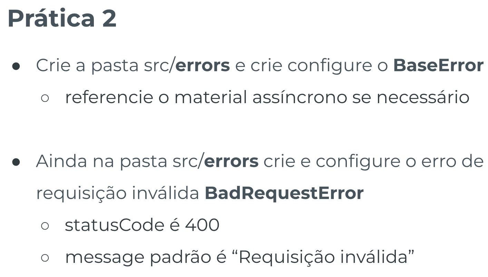
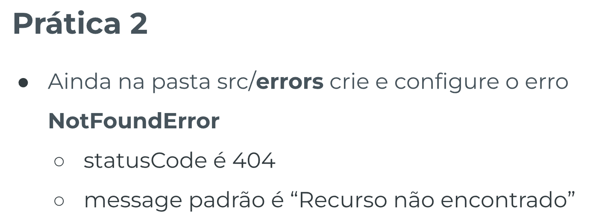
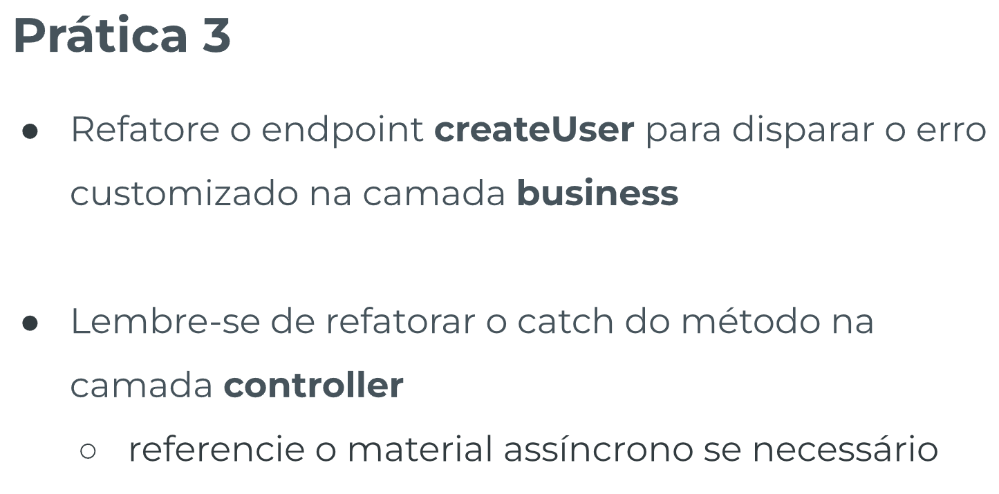
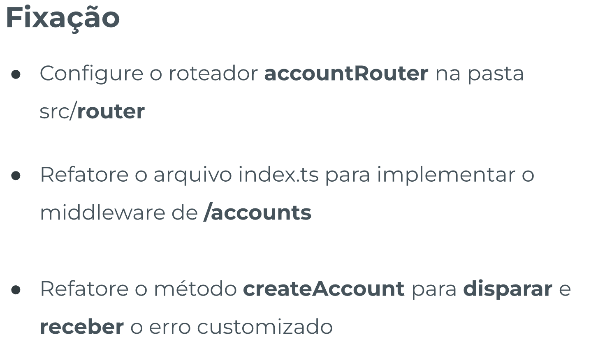

# Arquitetura 2 - Template de Prática

## Índice

-   [Prática Guiada 1](#prática-guiada-1)

    -   [Enunciado](#enunciado)
    -   [Resolução](#resolução)

-   [Prática Guiada 2](#prática-guiada-2)

    -   [Enunciado](#enunciado-1)
    -   [Resolução](#resoluc3a7c3a3o-1)

-   [Prática Guiada 3](#prática-guiada-3)

    -   [Enunciado](#enunciado-2)
    -   [Resolução](#resoluc3a7c3a3o-2)

-   [Fixação](#fixação)

    -   [Enunciado](#enunciado-3)
    -   [Resolução](#resoluc3a7c3a3o-3)

## Prática Guiada 1

### Enunciado



### Resolução

[🔼](#arquitetura-2---template-de-prática)

`src/router/userRouter.ts`

```ts
import express from 'express';
import { UserController } from '../controller/UserController';

export const userRouter = express.Router();

const userController = new UserController();

userRouter.get('/', userController.getUsers);
userRouter.post('/', userController.createUser);
```

`index.ts`

```ts
// const userController = new UserController();
// const accountController = new AccountController();

// app.get('/users', userController.getUsers);
// app.post('/users', userController.createUser);
app.use('/users', userRouter);
```

## Prática Guiada 2

### Enunciado





### Resolução

[🔼](#arquitetura-2---template-de-prática)

`src/errors/BaseError.ts`

```ts
export abstract class BaseError extends Error {
    constructor(public statusCode: number, message: string) {
        super(message);
    }
}
```

`src/errors/BadRequestError.ts`

```ts
import { BaseError } from './BaseError';

export class BadRequestError extends BaseError {
    constructor(
        message: string = 'Requisição inválida' // mensagem de erro padrão caso não seja enviado um argumento
    ) {
        super(400, message);
    }
}
```

`src/errors/NotFoundError.ts`

```ts
import { BaseError } from './BaseError';

export class NotFoundError extends BaseError {
    constructor(
        message: string = 'Recurso não encontrado' // mensagem de erro padrão caso não seja enviado um argumento
    ) {
        super(404, message);
    }
}
```

## Prática Guiada 3

### Enunciado



### Resolução

[🔼](#arquitetura-2---template-de-prática)

`src/controller`

Em `users` e em `accounts` mudar o **catch** para:

```ts
(...)
catch (error) {
    console.log(error);
            if (error instanceof BaseError) {
                res.status(error.statusCode).send(error.message);
            } else {
                res.status(500).send('Erro inesperado');
            }
        }
(...)
```

Em `business`, substituir os `Error`'s por `BadRequestError` ou o erro que for mais relevante. Como por exemplo:

```ts
(...)
    public createUser = async (input: any) => {
        const { id, name, email, password } = input;

        if (typeof id !== 'string') {
            throw new BadRequestError("'id' deve ser string");
        }
(...)
```

## Fixação

### Enunciado



### Resolução

[🔼](#arquitetura-2---template-de-prática)

`src/router/accountRouter.ts`

```ts
import express from 'express';
import { AccountController } from '../controller/AccountController';

export const accountRouter = express.Router();

const accountController = new AccountController();

accountRouter.get('/', accountController.getAccounts);
accountRouter.get('/:id/balance', accountController.getAccountBalance);
accountRouter.post('/', accountController.createAccount);
accountRouter.put(
    '/accounts/:id/balance',
    accountController.editAccountBalance
);
```

`index.ts`

```ts
(...)
// app.get('/accounts', accountController.getAccounts);
// app.get('/accounts/:id/balance', accountController.getAccountBalance);
// app.post('/accounts', accountController.createAccount);
// app.put('/accounts/:id/balance', accountController.editAccountBalance);
app.use('/accounts', accountRouter);
(...)
```

Em `business`, substituir os `Error`'s por `BadRequestError` ou o erro que for mais relevante. Como por exemplo:

```ts
(...)
    public createAccount = async (input: any) => {
        const { id, ownerId } = input;

        if (typeof id !== 'string') {
            throw new BadRequestError("'id' deve ser string");
        }
(...)
```
